# OpenAIRev

Cross-model AI code reviewer and workflow orchestrator for AI-assisted coding. The executor is never its own reviewer — independent judgment by default.

OpenAIRev orchestrates AI coding agents (Claude Code, Codex CLI, and more) so that one model reviews another's output. You choose which models pair up. The defaults are opinionated but fully configurable — including self-review if that's what you want.

<p align="center">
  
</p>

## Install

```bash
npm install -g openairev
```

Requires at least one AI coding CLI installed:
- [Claude Code CLI](https://docs.anthropic.com/en/docs/claude-code)
- [Codex CLI](https://github.com/openai/codex)

## Quick Start

```bash
cd your-project

# One-time setup
openairev init

# Quick: implement current task → code review loop
openairev review --task "Add auth middleware"

# Full workflow: analyze → plan → plan review → implement → code review
openairev review --plan --task "Add auth middleware"

# With OpenSpec reference
openairev review --plan --spec-ref openspec/changes/070_add-dashboard/

# Single review of existing changes, no workflow
openairev review --once

# Resume an interrupted or blocked workflow
openairev resume
```

## How It Works

OpenAIRev runs a stage-driven workflow:

```
analyze → planning → plan_review → implementation → code_review → done
               ↑          ↓                              ↓
          awaiting_user  plan_fix                      code_fix
```

Each stage:

1. **Analyze** — executor examines the codebase and task. If clarification is needed, transitions to `awaiting_user` (blocked until you answer via `openairev resume`).
2. **Planning** — executor creates a phased implementation plan.
3. **Plan review** — reviewer checks scope, sequencing, missing requirements, risk. Uses a separate plan-review prompt.
4. **Implementation** — executor writes code for the current phase.
5. **Code review** — reviewer checks correctness, edge cases, regressions. If `needs_changes`, executor fixes and re-reviews. If approved and more phases remain, loops back to implementation.
6. **Done** — all phases approved.

Stages are optional. `--quick` skips analyze and goes straight to implement → review. `--once` skips the workflow entirely and does a single review of existing changes.

OpenAIRev uses the CLIs' non-interactive modes (`claude -p`, `codex exec`) — no API keys needed. Works with your existing subscriptions.

## CLI Reference

### `openairev init`

Interactive setup wizard. Detects installed CLIs, lets you configure:
- Which agents to use
- Who reviews whose code (any combination)
- Max iterations per direction
- Tool gate commands (test, lint, typecheck)

### `openairev review`

Start a review workflow or single review.

```
Options:
  -e, --executor <agent>  Who wrote the code (claude_code|codex)
  -r, --reviewer <agent>  Who reviews (claude_code|codex)
  --diff <ref>            Git diff ref (default: staged or unstaged)
  --file <path>           Review a specific file instead of diff
  --task <description>    Task description for requirement checking
  --spec-ref <path>       Path to OpenSpec change directory
  --rounds <number>       Max review-fix rounds
  --plan                  Full workflow: analyze → plan → review → implement
  --quick                 Skip analyze, go straight to implement → review
  --once                  Single review only, no workflow
  --dry-run               Show what would happen without executing
```

### `openairev resume`

Resume an active or blocked workflow. If blocked on `awaiting_user`, prompts for answers to pending questions.

```
Options:
  --chain <id>  Resume a specific chain by ID
```

### `openairev status`

Show current workflow state: stage, agents, rounds, pending questions.

### `openairev history`

List past workflows and sessions.

```
Options:
  -n, --limit <number>  Number of items to show (default: 10)
  --chains              Show workflow chains instead of sessions
```

## Workflow Stages

### Review iterations

Each iteration is one complete executor↔reviewer cycle:

```
Iteration 1: Executor writes code → Reviewer reviews → "needs_changes"
Iteration 2: Executor fixes issues → Reviewer reviews again → "needs_changes"
Iteration 3: Executor fixes again → Reviewer reviews → "approved" ✓
```

The reviewer does a thorough single-pass review each iteration, covering surface issues, edge cases, requirements, and false positive reconsideration — all in one shot.

### Plan review vs code review

- **Plan review** checks scope, sequencing, missing requirements, and risk. Uses `plan-reviewer.md` prompt and a separate verdict schema with `missing_requirements`, `sequencing_issues`, and `risks` fields.
- **Code review** checks correctness, regressions, edge cases, and test gaps. Uses `reviewer.md` prompt.

### Multi-phase implementation

The executor's plan can define phases (`PHASE: <name>` / `GOAL: <goal>` in output). Each phase goes through its own implementation → code review loop. When a phase is approved, the next phase begins.

### User clarification

During analysis, if the executor outputs lines starting with `QUESTION:`, the workflow blocks (`awaiting_user`). Run `openairev resume` to answer the questions and continue.

### Why different defaults per direction

`max_iterations` controls how many rounds the **executor** gets to align with reviewer feedback:

- **Claude Code as executor → 5 iterations** — Claude is less stable at consistently applying reviewer feedback across rounds. More iterations give it room to converge.
- **Codex as executor → 1 iteration** — Codex applies review feedback more reliably, so a single cycle is usually sufficient.

Override per-run with `--rounds`.

## Review Verdict

Every code review returns a structured JSON verdict:

```json
{
  "status": "approved | needs_changes | reject",
  "critical_issues": [],
  "test_gaps": [],
  "requirement_mismatches": [],
  "rule_violations": [],
  "risk_level": "low | medium | high",
  "confidence": 0.88,
  "repair_instructions": [],
  "false_positives_reconsidered": []
}
```

Plan reviews return a similar verdict with `missing_requirements`, `sequencing_issues`, and `risks` instead.

## Executor Feedback

When a reviewer returns `needs_changes`, the feedback is wrapped in a behavioral prompt that tells the executor:

- This is a **peer review**, not a user command
- Use your own judgment — don't blindly apply every suggestion
- Accept real bugs, ignore style nits, push back on low-confidence items

The executor keeps full autonomy over what to fix.

## MCP Server

OpenAIRev includes an MCP server so both CLIs can trigger reviews as tool calls.

### Add to Claude Code

In your project's `.claude/settings.json` or `~/.claude/settings.json`:

```json
{
  "mcpServers": {
    "openairev": {
      "command": "node",
      "args": ["/path/to/openairev/src/mcp/mcp-server.js"]
    }
  }
}
```

### Add to Codex CLI

In `~/.codex/config.toml`:

```toml
[mcp_servers.openairev]
command = "node"
args = ["/path/to/openairev/src/mcp/mcp-server.js"]
```

### MCP Tools

| Tool | Description |
|------|-------------|
| `openairev_review` | Send diff to reviewer, get structured verdict |
| `openairev_status` | Check most recent review result |
| `openairev_run_tests` | Run project test suite |
| `openairev_run_lint` | Run linter |
| `openairev_get_diff` | Get current git diff |

## Config

Generated by `openairev init` at `.openairev/config.yaml`:

```yaml
agents:
  claude_code:
    cmd: claude
    available: true
  codex:
    cmd: codex
    available: true

review_policy:
  claude_code:
    reviewer: codex
    max_iterations: 5       # Claude needs more rounds to align with feedback
  codex:
    reviewer: claude_code
    max_iterations: 1       # Codex applies feedback more consistently

review_trigger: explicit

tools:
  run_tests: npm test
  run_lint: npm run lint
  run_typecheck: npx tsc --noEmit

session:
  store_history: true
  archive_after: 7d
```

All pairings and iteration counts are user-configurable during `openairev init`. Any combination is valid: cross-review, self-review, one-way only, or skip.

## OpenSpec Integration

If your project uses [OpenSpec](https://github.com/rsktash/yuklar) for spec-driven development, pass the change directory with `--spec-ref`:

```bash
openairev review --plan --spec-ref openspec/changes/070_add-admin-dashboard-ui/
```

The reviewer will read the spec's requirements and scenarios to validate the code against them. If an OpenSpec change exists, the plan review stage checks the proposal against the spec structure.

## Customizing Review Prompts

After init, review prompts are copied to `.openairev/prompts/`. Edit them to customize:

- `reviewer.md` — code review behavioral contract
- `plan-reviewer.md` — plan review behavioral contract
- `executor-feedback.md` — how review feedback is framed to the executor

## Large Diffs

For diffs over 8K characters, OpenAIRev writes the content to `.openairev/tmp/` and tells the reviewer to read the file from disk. Both CLIs have built-in file reading, so there's no size limit.

## License

MIT
